# Báo Cáo So Sánh Hiệu Năng & Bảo Mật

Tài liệu này cung cấp mẫu báo cáo và số liệu tham khảo (Sample Data) để bạn điền kết quả thực tế sau khi test bằng JMeter.

## 1. Các Phương Pháp Được So Sánh

Chúng ta sẽ so sánh 3 kịch bản để thấy rõ sự khác biệt:

1.  **Baseline (Không Bảo Mật):** Gọi trực tiếp vào Backend, không có check token hay rate limit.
2.  **Application Level (Bảo Mật Tại Code):** Backend (NestJS) tự thực hiện check Token và Rate Limit (dùng thư viện như `npm rate-limiter-flexible`).
    *   *Đặc điểm:* Tốn tài nguyên CPU của Backend để xử lý logic bảo mật.
3.  **Gateway Level (Mô hình hiện tại):** Kong Gateway xử lý hết bảo mật trước khi request vào Backend.

---

## 2. Bảng Số Liệu So Sánh (Mẫu Tham Khảo)

Dưới đây là số liệu **giả định** dựa trên benchmark tiêu chuẩn để bạn hình dung kết quả kỳ vọng. Hãy thay thế bằng số liệu thực tế của bạn.

**Cấu hình Test:** 500 Users, Ramp-up 10s, Chạy trong 60s.

| Tiêu Chí | 1. Không Bảo Mật (Direct) | 2. Bảo Mật Tại Code (Node.js) | 3. Bảo Mật Tại Gateway (Kong) |
| :--- | :--- | :--- | :--- |
| **Throughput (Req/sec)** | 2000/s | 1200/s (Giảm 40%) | **1800/s** (Chỉ giảm 10%) |
| **Avg Latency (ms)** | 50ms | 150ms (Tăng do xử lý logic) | **60ms** (Tăng nhẹ do thêm hop) |
| **CPU Backend (VPS)** | 40% | **95% (Quá tải)** | **45%** (Ổn định) |
| **Khả năng chịu tải** | Cao (nhưng rủi ro hổng) | Thấp (Dễ bị DDoS sập App) | **Rất Cao** (Chặn ngay tại cửa) |
| **Kết quả khi bị tấn công** | Backend sập / DB treo | Backend chậm dần rồi sập | **Backend vẫn sống khỏe** |

### Phân Tích:
-   **Phương pháp 2 (Tại Code):** Node.js là đơn luồng (single-thread). Nếu bắt nó gánh thêm việc check Rate Limit và verify JWT cho hàng ngàn request rác, Event Loop sẽ bị chặn (block), dẫn đến hiệu năng tụt dốc thảm hại.
-   **Phương pháp 3 (Gateway):** Kong viết bằng Nginx/Lua (C/C++), được tối ưu cực tốt cho việc xử lý connection. Nó lọc sạch rác nên Backend chỉ phải xử lý các request "sạch", giữ cho CPU Backend thấp.

---

## 3. Hướng Dẫn Lấy Số Liệu Cụ Thể

Để điền vào bảng trên, bạn hãy chạy JMeter cho từng trường hợp:

### Trường hợp 1: Đo "Không Bảo Mật"
-   **Setup:** Tắt Kong, mở port 3000 của `usersvc` ra ngoài (hoặc test nội bộ). Tạm thời comment code check Guard trong NestJS (nếu có).
-   **JMeter:** Bắn vào `http://localhost:3000/api/public`.
-   **Ghi lại:** Throughput và CPU (dùng `docker stats`).

### Trường hợp 2: Đo "Bảo Mật Tại Code" (Giả lập)
-   **Setup:** Trong `usersvc`, thêm một Middleware giả lập việc tính toán nặng (ví dụ: vòng lặp for chạy 10.000 lần hoặc sleep 50ms) để mô phỏng việc verify token và check DB cho rate limit.
-   **JMeter:** Bắn vào `http://localhost:3000/api/protected`.
-   **Ghi lại:** Bạn sẽ thấy Throughput giảm hẳn và CPU tăng cao.

### Trường hợp 3: Đo "Gateway Level" (Hiện tại)
-   **Setup:** Chạy full stack (Kong + Usersvc).
-   **JMeter:** Bắn vào `http://localhost:8000/api`.
-   **Ghi lại:** Throughput sẽ cao gần bằng trường hợp 1, nhưng CPU của `usersvc` lại thấp hơn nhiều so với trường hợp 2.

---

## 4. Biểu Đồ Minh Họa (Dùng cho Báo Cáo)

Bạn có thể vẽ biểu đồ cột đơn giản từ số liệu trên:

```mermaid
gantt
    title So Sánh Tài Nguyên Tiêu Thụ (CPU Backend) khi có 1000 Req/s
    dateFormat X
    axisFormat %s
    
    section CPU Usage
    Không Bảo Mật (40%)      : 0, 40
    Bảo Mật Tại Code (95%)   : 0, 95
    Qua Kong Gateway (45%)   : 0, 45
```

*(Lưu ý: Đây là biểu đồ minh họa mức độ chiếm dụng CPU)*
