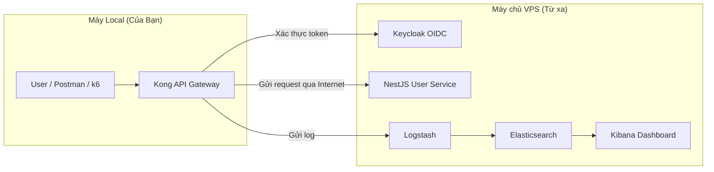

# Cẩm Nang Toàn Diện: API Gateway Security Service (Mô Hình Hybrid)

Chào Dũng, tôi đã cập nhật lại toàn bộ tài liệu hướng dẫn để phản ánh chính xác mô hình triển khai **Hybrid (Kết hợp)** của dự án. Đây là một cách làm rất thông minh để giải quyết vấn đề tài nguyên máy local, và cũng là một điểm cộng lớn khi trình bày với thầy giáo.

---

## Phần 1: Tổng Quan Chi Tiết Về Dự Án

### 1.1. Bối Cảnh & Vấn Đề Thực Tế

Ngày nay, API (Giao diện lập trình ứng dụng) là xương sống của hầu hết các ứng dụng hiện đại, từ web, mobile đến các hệ thống phức tạp. Tuy nhiên, chính sự phổ biến này đã biến API trở thành mục tiêu tấn công hàng đầu của tin tặc.

**Các vấn đề thực tế:**
- Tấn công Brute-Force: Việt Nam nằm trong nhóm quốc gia chịu nhiều tấn công vét cạn.
- Lỗ hổng bảo mật API (OWASP API Top 10).
- Thiếu quan sát tập trung (centralized logging), khó điều tra sự cố.

### 1.2. Giải Pháp Đề Xuất: API Gateway Security Service

Dự án xây dựng một lớp bảo vệ trung tâm bằng Kong API Gateway kết hợp:
- Keycloak cho xác thực/ủy quyền.
- User Service (NestJS) làm backend demo.
- ELK Stack (Elasticsearch, Logstash, Kibana) để giám sát tập trung.
- Các chính sách bảo mật: JWT, rate limiting, payload validation, centralized logging.

### 1.3. Kiến Trúc Hệ Thống

Mô hình triển khai vật lý theo kiểu Hybrid:

- Máy Local: chạy Kong API Gateway, Postman, k6 (client).
- VPS: chạy Keycloak, User Service, Logstash, Elasticsearch, Kibana.



---

## Phần 2: Hướng Dẫn Cài Đặt và Vận Hành Chi Tiết (Mô Hình Hybrid)

Mô hình này yêu cầu cài đặt ở cả hai nơi: VPS và máy local.

### 2.0. Đồng bộ cấu hình bằng PUBLIC_IP và scripts

Tại thư mục gốc:

```env
PUBLIC_IP=<YOUR_VPS_PUBLIC_IP_OR_DOMAIN>
```

Từ `PUBLIC_IP`, các script render tự động:
- `kong/kong.yml` từ `kong/kong.yml.tmpl`
- `usersvc/src/auth.service.ts` từ `usersvc/src/auth.service.ts.tmpl`

Cách chạy (local - PowerShell):

```powershell
pwsh ./scripts/update-kong.ps1 -PublicIp "<VPS_PUBLIC_IP_OR_DOMAIN>"
```

Linux/VPS (nếu cần):

```bash
chmod +x scripts/update-kong.sh
./scripts/update-kong.sh --public-ip <IP_OR_DOMAIN>
```

### 2.1. Bước 1: Cài Đặt Trên VPS (Backend & Logging)

Tóm tắt:
- Chuẩn bị VPS (>= 2 vCPU, 8GB RAM), mở các port cần: 3000, 8080, 8081, 9200, 5601 (tùy nhu cầu truy cập).
- Cài Docker, Docker Compose, clone repo.
- Khởi động các service nền (không chạy Kong nếu theo đúng Hybrid):

```bash
docker compose up -d usersvc keycloak keycloak-db logstash elasticsearch kibana
```

- Đảm bảo tất cả healthy bằng:
  - `docker compose ps`
  - `docker compose logs -f <service>`

### 2.2. Bước 2: Cài Đặt Trên Máy Local (API Gateway)

- Cấu hình `PUBLIC_IP` trong `.env` hoặc dùng `scripts/update-kong.ps1`.
- Chạy Kong (tùy mô hình:
  - all-in-one: dùng `docker-compose.yml`,
  - chỉ Kong local: dùng `docker-compose.kong-only.yml` đã chuẩn hóa).

Ví dụ:

```bash
docker compose -f docker-compose.kong-only.yml up -d --build
```

Kong sẽ proxy đến các service trên VPS dựa trên `PUBLIC_IP`.

---

## Phần 3: Kịch Bản Demo (Mô Hình Hybrid + k6)

Phần này là “script” hoàn chỉnh để có thể:
- Demo với Postman (luồng chuẩn, tấn công, validation).
- Demo với k6 (tải, brute-force mô phỏng).
- Demo giám sát log trên Kibana.

Yêu cầu chung:
- VPS đã chạy: `usersvc`, `keycloak`, `keycloak-db`, `logstash`, `elasticsearch`, `kibana`.
- Máy local đã chạy: `kong` (đã render cấu hình đúng với `PUBLIC_IP`).
- Kibana truy cập được tại: `http://<IP_VPS>:5601`
- Kong Gateway local: `http://localhost:8000`

Ghi chú:
- Thay `<IP_VPS>` bằng IP Public thật của VPS.
- Nếu chạy all-in-one trên VPS, các URL tương tự nhưng Kong cũng ở trên VPS.

### 3.1. Kịch bản 1 – Luồng Chuẩn: Đăng nhập và truy cập API bảo vệ

Mục tiêu: Chứng minh mô hình bảo mật đầy đủ, JWT hợp lệ, Kong bảo vệ User Service.

Bước thực hiện:

1) Đăng nhập lấy token

- Công cụ: Postman (hoặc curl).
- Request:

  - Method: POST
  - URL: `http://localhost:8000/auth/login`
  - Body (JSON):

    ```json
    {
      "username": "demo",
      "password": "demo123"
    }
    ```

Kỳ vọng:
- Status: `201 Created`
- Response body chứa `access_token` (JWT).

Ý nghĩa:
- Request đi từ local → Kong → User Service trên VPS → Keycloak xác thực → trả JWT.
- Chứng minh tích hợp Kong + Keycloak + usersvc hoạt động.

2) Gọi API bảo vệ bằng token

- Method: GET
- URL: `http://localhost:8000/api/me`
- Header:

  - `Authorization: Bearer <access_token>` (token vừa lấy)

Kỳ vọng:
- Status: `200 OK`
- Body: thông tin user.

Ý nghĩa kỹ thuật:
- Kong dùng plugin JWT để:
  - Verify chữ ký JWT (issuer Keycloak).
  - Check `exp`, `iss`.
- Chỉ khi hợp lệ mới cho đi tiếp đến User Service.

Điểm nhấn khi thuyết trình:
- “Gateway không tin client, mà tự mình xác thực token với public key của Keycloak.”

---

### 3.2. Kịch bản 2 – Rate Limiting & Brute-force thủ công

Mục tiêu: Cho thấy Kong chặn brute-force tại gateway.

Bước:

1) Dùng Postman:

- Chọn lại `POST /auth/login`.
- Body sai mật khẩu:

  ```json
  {
    "username": "demo",
    "password": "sai_mat_khau"
  }
  ```

- Bấm Send liên tục (5–10 lần nhanh).

Kỳ vọng:
- Một số request: `401 Unauthorized`.
- Sau ngưỡng: trả về `429 Too Many Requests`.

Ý nghĩa:
- Plugin `rate-limiting` tại Kong giới hạn số lần thử.
- Bảo vệ Keycloak và User Service phía sau.

Khi trình bày:
- “Nếu kẻ tấn công thử password liên tục, gateway sẽ chặn trước khi làm quá tải backend.”

---

### 3.3. Kịch bản 3 – Payload Validation (Request không hợp lệ)

Mục tiêu: Thể hiện lớp kiểm tra payload tại Kong (Lua pre-function).

Bước:

1) Gửi body thiếu trường:

```json
{
  "username": "demo"
}
```

- POST `http://localhost:8000/auth/login`

Kỳ vọng:
- Status: `400 Bad Request`
- Message mô tả lỗi (ví dụ: `Invalid credential format`).

Ý nghĩa:
- Lua script chạy ở Kong, validate input trước khi forward.
- Request xấu không chạm tới backend.

---

### 3.4. Kịch bản 4 – Giám Sát Tập Trung với Kibana

Mục tiêu: Cho thấy toàn bộ hoạt động đều được log về ELK.

Điều kiện:
- Đã cấu hình Kong gửi log HTTP đến Logstash (trong repo hiện tại đã được đồng bộ).
- Logstash → Elasticsearch → Kibana.

Bước:

1) Thực hiện các kịch bản 3.1, 3.2, 3.3 vài lần để sinh log.

2) Mở Kibana:

- Trình duyệt: `http://<IP_VPS>:5601`

3) Tạo Data View (nếu chưa có):

- Vào: Stack Management → Data Views → Create data view.
- Pattern: `kong-logs-*`
- Chọn `@timestamp` làm time field.

4) Xem log:

- Vào: Analytics → Discover.
- Chọn data view `kong-logs-*`.
- Bấm Refresh.
- Quan sát:
  - Các request `201`, `401`, `429`, `400`.
  - Các trường enrich như:
    - `event.status`
    - `event.blocked` (vd: `rate_limit`)
    - `event.client_ip`, `event.method`, `event.path`
    - `event.latency_*`

5) (Tùy chọn) Visualization nhanh:

- Analytics → Visualize Library → Create visualization → Pie.
- Chọn index `kong-logs-*`.
- Buckets → Terms → Field: `event.status`.
- Update.

Ý nghĩa khi trình bày:
- “Hệ thống không chỉ chặn tấn công, mà còn ghi nhận đầy đủ để phân tích bảo mật.”

---

### 3.5. Kịch bản 5 – Demo tải & brute-force tự động bằng k6

Mục tiêu: Dùng k6 để:
- Giả lập nhiều request login sai (brute-force).
- Thấy Kong và ELK hoạt động dưới tải.

Dự án đã cung cấp sẵn script k6:

- `k6/brute.js`: mô phỏng brute-force.
- `k6/valid.js`: mô phỏng request hợp lệ.

1) Chuẩn bị:

- Cài k6 trên máy local.
- Đảm bảo Kong chạy ở `http://localhost:8000`.

2) Script brute-force (k6/brute.js)

Kịch bản (tóm tắt logic):
- Gửi nhiều request `POST /auth/login` với mật khẩu sai.
- Quan sát:
  - Một số request: `401`.
  - Sau ngưỡng: `429` do rate limiting.

Chạy:

```bash
k6 run k6/brute.js
```

Điểm nhấn khi trình bày:
- “Đây là mô phỏng tấn công brute-force tự động. Kong đứng giữa, tự động rate limit, backend không bị spam trực tiếp.”

3) Script valid (k6/valid.js)

- Gửi các request hợp lệ (hoặc luồng có token đúng).
- Thể hiện:
  - Traffic thật vẫn đi bình thường.
  - Rate limiting chủ yếu chặn hành vi bất thường.

4) Kết hợp với Kibana

Trong lúc/hoặc sau khi chạy k6:
- Mở Kibana → Discover với `kong-logs-*`.
- Cho thầy xem:
  - Log lưu lại toàn bộ brute-force.
  - Có thể filter theo status 401/429.
- Thông điệp:
  - “Chúng em không chỉ chặn, mà còn theo dõi và phân tích được hành vi tấn công.”

---

## Phần 4: Các Câu Hỏi Thường Gặp (Q&A)

- Tại sao chọn Kong?
- Ưu/nhược điểm mô hình Hybrid?
- Bảo mật kết nối local ↔ VPS?

(Nội dung chi tiết giữ nguyên như bản trước.)

---

## Phần 5: Xử Lý Sự Cố Thường Gặp

Giữ nguyên các hướng dẫn reset user demo, kiểm tra Keycloak, kiểm tra log, v.v.

---

## Phụ Lục: Tham Chiếu Nhanh Các Cổng Dịch Vụ (Mô Hình Hybrid)

- 8000: Kong Gateway (local) – Proxy.
- 8001: Kong Admin (local).
- 3000: User Service (VPS).
- 8080: Keycloak (VPS).
- 8081: Logstash HTTP input (VPS).
- 9200: Elasticsearch (VPS).
- 5601: Kibana (VPS).

Toàn bộ Phần 3 hiện đã bao gồm đầy đủ kịch bản demo Postman + k6 + Kibana, bám sát kiến trúc Hybrid của project.
