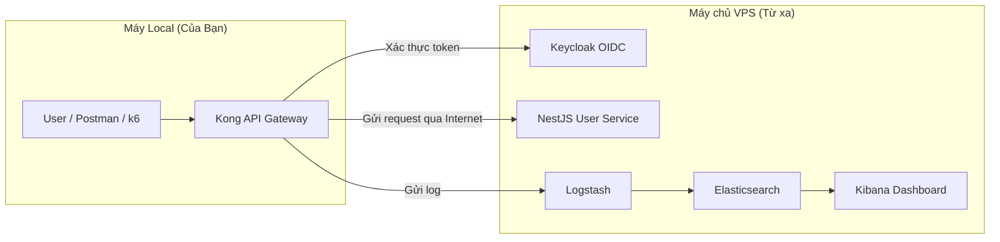

# Cẩm Nang Toàn Diện: API Gateway Security Service (Mô Hình Hybrid)

Chào Dũng, tôi đã cập nhật lại toàn bộ tài liệu hướng dẫn để phản ánh chính xác mô hình triển khai **Hybrid (Kết hợp)** của dự án. Đây là một cách làm rất thông minh để giải quyết vấn đề tài nguyên máy local, và cũng là một điểm cộng lớn khi trình bày với thầy giáo.

---

## Phần 1: Tổng Quan Chi Tiết Về Dự Án

### 1.1. Bối Cảnh & Vấn Đề Thực Tế

Ngày nay, API (Giao diện lập trình ứng dụng) là xương sống của hầu hết các ứng dụng hiện đại, từ web, mobile đến các hệ thống phức tạp. Tuy nhiên, chính sự phổ biến này đã biến API trở thành mục tiêu tấn công hàng đầu của tin tặc.

**Các vấn đề thực tế:**
- **Tấn công Brute-Force:** Theo báo cáo của Kaspersky, Việt Nam đứng đầu Đông Nam Á về số vụ tấn công "vét cạn" (brute-force) trong năm 2024, một minh chứng rõ ràng cho mức độ nghiêm trọng của vấn đề.
- **Lỗ hổng bảo mật:** Báo cáo của OWASP chỉ ra rằng hơn 70% sự cố bảo mật đến từ API.
- **Điểm yếu của hệ thống truyền thống:** Các service backend thường thiếu các lớp bảo vệ chuyên biệt, dễ bị tấn công, gửi dữ liệu sai định dạng và đặc biệt là thiếu khả năng giám sát tập trung để phát hiện và điều tra sự cố.

### 1.2. Giải Pháp Đề Xuất: API Gateway Security Service

Để giải quyết các bài toán trên, dự án này xây dựng một **lớp bảo vệ trung tâm** sử dụng kiến trúc API Gateway hiện đại. Mọi yêu cầu từ bên ngoài đều phải đi qua cổng bảo vệ này trước khi đến được các dịch vụ nghiệp vụ.

### 1.3. Kiến Trúc Hệ Thống

Kiến trúc logic của dự án vẫn tuân thủ mô hình microservice, tuy nhiên, mô hình triển khai vật lý được chia làm hai phần để tối ưu hiệu năng:

- **Máy chủ VPS (Từ xa):** Chạy các dịch vụ "nặng" và yêu cầu tài nguyên lớn như Keycloak, User Service và đặc biệt là bộ ELK Stack.
- **Máy Local (Máy thật):** Chỉ chạy thành phần nhẹ là Kong API Gateway, đóng vai trò là cổng vào duy nhất.



**Vai trò của các thành phần:**
- **Kong API Gateway (Người Lính Gác Cổng):** Chịu trách nhiệm kiểm soát toàn bộ traffic, thực thi các chính sách bảo mật như xác thực JWT, giới hạn tần suất request (rate-limiting), và kiểm tra payload.
- **Keycloak (Chuyên Gia Định Danh):** Là nhà cung cấp định danh (Identity Provider), chịu trách nhiệm xác thực người dùng (kiểm tra username/password) và cấp phát token (JWT) theo chuẩn OIDC/OAuth2.
- **User Service (NestJS - Logic Nghiệp Vụ):** Là dịch vụ backend được bảo vệ, chứa logic nghiệp vụ đơn giản như xử lý đăng nhập và trả về thông tin người dùng.
- **ELK Stack (Hệ Thống Camera Giám Sát):** Bao gồm Elasticsearch, Logstash, và Kibana, có nhiệm vụ thu thập, xử lý, lưu trữ và trực quan hóa toàn bộ log hệ thống, giúp giám sát và phát hiện các hoạt động bất thường.

---

## Phần 2: Hướng Dẫn Cài Đặt và Vận Hành Chi Tiết (Mô Hình Hybrid)

Mô hình này yêu cầu cài đặt ở cả hai nơi: VPS và máy local. Hãy thực hiện tuần tự và cẩn thận.

### 2.1. Bước 1: Cài Đặt Trên Máy Chủ VPS (Backend & Logging)

Đây là nơi chạy các dịch vụ "nặng". Các bước chi tiết đã có trong file `SETUP_REMOTE_INFRA.md`.

1.  **Chuẩn bị VPS:**
    *   Đảm bảo VPS có đủ tài nguyên (tối thiểu 2 vCPU, 8GB RAM).
    *   **Quan trọng:** Mở các cổng `3000`, `8080`, `8081`, `9200`, `5601` trong Security Group (AWS) hoặc UFW (Firewall) để máy local có thể kết nối vào.
2.  **Cài Docker & Tải Mã Nguồn:**
    *   Thực hiện các lệnh cài đặt Docker Engine, Docker Compose và clone repository về VPS.
3.  **Khởi chạy Dịch Vụ Nền:**
    *   Trên VPS, chạy lệnh sau để khởi động tất cả các service **TRỪ KONG**:
        ```bash
        # Lệnh chạy trên VPS
        docker compose up -d usersvc keycloak keycloak-db logstash elasticsearch kibana
        ```
4.  **Kiểm Tra Trạng Thái (Rất Quan Trọng):**
    *   Chờ khoảng 1-2 phút cho các dịch vụ khởi động.
    *   Chạy lệnh `docker compose ps` và kiểm tra cột `STATUS`. Tất cả các service phải có trạng thái `running (healthy)`. Nếu một service nào đó không `healthy`, hãy kiểm tra log của nó bằng `docker compose logs -f <tên_service>`.
  *   Ghi lại địa chỉ **IP Public của VPS** (ví dụ: `13.250.36.84`).

### 2.2. Bước 2: Cài Đặt Trên Máy Local (API Gateway)

Đây là nơi chỉ chạy Kong API Gateway, đóng vai trò là "cửa ngõ" của hệ thống.

1.  **Cấu Hình IP một lần (mới):**
    *   Sửa biến `PUBLIC_IP` trong file `.env` ở thư mục gốc.
    *   Chạy script PowerShell `scripts/render-kong.ps1` để sinh file `kong/kong.yml` từ template `kong/kong.yml.tmpl` dùng IP này.
    *   `docker-compose.yml` cũng đã dùng `${PUBLIC_IP}` cho `KEYCLOAK_REALM_URL` và `KC_HOSTNAME`.
2.  **Khởi Chạy Kong:**
    *   Sử dụng file `docker-compose.kong-only.yml` được thiết kế riêng để chỉ chạy Kong:
        ```bash
        # Lệnh chạy trên máy Local
        docker compose -f docker--compose.kong-only.yml up -d --build
        ```
3.  **Kiểm Tra Kết Nối:**
    *   Sau khi Kong khởi động, hãy kiểm tra xem nó có thể "nói chuyện" với các service trên VPS không. Mở một terminal và chạy:
        ```bash
        # Kiểm tra kết nối đến User Service trên VPS
        curl http://<IP_VPS>:3000/
        # Nếu nhận được lỗi 404 Not Found là thành công, vì service đang chạy nhưng không có route nào ở đường dẫn gốc.
        ```

Hệ thống của bạn giờ đã sẵn sàng: Gateway chạy ở local, lắng nghe trên cổng 8000, và sẽ chuyển tiếp request đến các dịch vụ đang chạy trên VPS.

---

## Phần 3: Kịch Bản Demo (Mô Hình Hybrid)

Đây là kịch bản từng câu từng chữ để bạn có thể thực hành và trình bày một cách trôi chảy.

**Chuẩn bị:**
- Mở sẵn **Postman**.
- Mở sẵn trình duyệt và truy cập Kibana trên VPS: `http://<IP_VPS>:5601`.

*   **Kịch bản 1: Luồng Hoạt Động Chuẩn - "Cánh Cửa Mở Ra"**
    1.  **Hành động:** Mở Postman. Chọn request `POST /auth/login`. Đảm bảo URL là `http://localhost:8000/auth/login` và body là:
        ```json
        {
            "username": "demo",
            "password": "demo123"
        }
        ```
        Bấm **Send**.
    2.  **Lời thoại:** "Thưa thầy, em xin bắt đầu với luồng hoạt động chuẩn. Em sẽ gửi một yêu cầu đăng nhập từ Postman trên máy của em đến Kong Gateway đang chạy tại `localhost:8000`."
    3.  **Hành động:** Chỉ vào kết quả thành công trong Postman (status `201 Created`).
    4.  **Lời thoại:** "Request này đã được Kong Gateway (chạy local) chuyển tiếp qua Internet đến User Service (chạy trên VPS). Service này đã gọi Keycloak (cũng trên VPS) để xác thực và trả về một `access_token` theo chuẩn JWT. Đây là tấm vé thông hành của chúng ta."
    5.  **Hành động:** Copy giá trị `access_token`. Mở request `GET /api/me`. Dán token vào header `Authorization` theo định dạng `Bearer <token>`. Bấm **Send**.
    6.  **Lời thoại:** "Bây giờ, em sẽ dùng token này để truy cập một API cần bảo vệ. Khi request đến, Kong Gateway sẽ tự mình dùng plugin JWT để kiểm tra chữ ký và thời hạn của token. Vì token hợp lệ, request được đi tiếp đến User Service trên VPS và trả về thông tin người dùng thành công."

*   **Kịch bản 2: Tấn Công Brute-Force - "Kẻ Xấu Gõ Cửa"**
    1.  **Hành động:** Quay lại request `POST /auth/login`. Sửa `password` thành một giá trị sai, ví dụ `"111111"`. Bấm **Send** liên tục, nhanh chóng 5-6 lần.
    2.  **Lời thoại:** "Tiếp theo, em sẽ mô phỏng một cuộc tấn công Brute-Force, khi kẻ xấu cố gắng dò mật khẩu bằng cách thử sai liên tục."
    3.  **Hành động:** Chỉ vào các kết quả trong Postman. Vài lần đầu sẽ là `401 Unauthorized`. Sau đó sẽ là `429 Too Many Requests`.
    4.  **Lời thoại:** "Thầy có thể thấy, sau 5 lần thử sai, Kong Gateway đã kích hoạt cơ chế Rate Limiting và trả về lỗi 429. Cuộc tấn công đã bị chặn đứng ngay tại cổng, giúp bảo vệ User Service và Keycloak trên VPS khỏi bị quá tải."

*   **Kịch bản 3: Gửi Dữ Liệu Sai - "Gói Hàng Không Hợp Lệ"**
    1.  **Hành động:** Vẫn ở request đăng nhập, sửa body thành một JSON không hợp lệ, ví dụ xóa hoàn toàn trường `password`:
        ```json
        {
            "username": "demo"
        }
        ```
        Bấm **Send**.
    2.  **Lời thoại:** "Một kiểu tấn công khác là gửi dữ liệu sai cấu trúc để gây lỗi cho backend. Tuy nhiên, em đã dùng một script Lua ngay tại Kong để kiểm tra payload trước."
    3.  **Hành động:** Chỉ vào kết quả `400 Bad Request` và message lỗi `Invalid credential format`.
    4.  **Lời thoại:** "Request này đã bị từ chối ngay tại Gateway trên máy local vì không đáp ứng đúng định dạng, không bao giờ chạm tới được service nghiệp vụ trên VPS."

*   **Kịch bản 4: Giám Sát Tập Trung - "Đôi Mắt Thần"**
  1.  **Hành động:** Chuyển sang cửa sổ trình duyệt đang mở Kibana tại `http://<IP_VPS>:5601`.
    2.  **Lời thoại:** "Và phần hay nhất là: mọi hoạt động vừa rồi, dù thành công hay thất bại, dù diễn ra ở local hay VPS, đều được ghi lại và phân tích tại một nơi duy nhất."
    3.  **Hành động:**
        *   Vào menu **Analytics > Discover**. Bấm **Refresh**.
        *   Chỉ vào các dòng log mới nhất, cho thấy các request `201`, `401`, `429`, `400` vừa thực hiện.
        *   Click vào một dòng log, mở rộng nó ra và chỉ vào các trường đã được làm giàu như `geoip.country_name` hay `event.blocked: rate_limit`.
    4.  **Lời thoại:** "Mặc dù Gateway chạy ở local, nó đã được cấu hình để gửi log đến Logstash trên VPS. Logstash đã xử lý, làm giàu thông tin và lưu vào Elasticsearch. Nhờ vậy, chúng ta có một hệ thống giám sát tập trung, theo dõi được mọi hoạt động từ xa."
    5.  **Hành động (Gây ấn tượng):**
        *   Vào menu **Analytics > Visualize Library**.
        *   Click **Create visualization > Pie**.
        *   Chọn index pattern `kong-logs-*`.
        *   Trong phần **Buckets**, click **Add > Terms**.
        *   Trong ô **Field**, chọn `event.status`. Click **Update**.
    6.  **Lời thoại:** "Và chỉ với vài cú click, chúng ta có thể nhanh chóng tạo ra một biểu đồ trực quan hóa tỷ lệ các loại response, giúp đội an ninh dễ dàng phát hiện các dấu hiệu bất thường trong thời gian thực."

---

## Phần 4: Các Câu Hỏi Thường Gặp (Q&A)

Đây là một số câu hỏi có thể bạn sẽ gặp trong quá trình báo cáo và gợi ý trả lời:

- **Câu hỏi:** *Tại sao lại chọn Kong mà không phải một gateway khác (ví dụ: NGINX, Traefik)?*
  - **Gợi ý trả lời:** Kong được chọn vì có hệ sinh thái plugin cực kỳ mạnh mẽ và sẵn có (như JWT, Rate Limiting), dễ dàng cấu hình ở chế độ DB-less, và được cộng đồng hỗ trợ rất tốt, phù hợp cho việc xây dựng một giải pháp bảo mật nhanh chóng và hiệu quả.

- **Câu hỏi:** *Mô hình triển khai Hybrid này có nhược điểm gì không?*
  - **Gợi ý trả lời:** Nhược điểm chính là độ trễ mạng (network latency) do request phải đi qua Internet từ máy local đến VPS. Ngoài ra, nó cũng phụ thuộc vào sự ổn định của kết nối Internet.

- **Câu hỏi:** *Làm thế nào để bảo mật kết nối giữa máy local và VPS?*
  - **Gợi ý trả lời:** Để tăng cường bảo mật, có thể áp dụng các giải pháp như thiết lập một mạng riêng ảo (VPN) giữa hai máy, hoặc cấu hình Security Group trên VPS để chỉ cho phép duy nhất địa chỉ IP của máy local được phép kết nối vào các cổng dịch vụ.

---

## Phần 5: Xử Lý Sự Cố Thường Gặp

### Sự cố: Đăng nhập thất bại với tài khoản `demo/demo123`

**Triệu chứng:** Khi thực hiện demo, bạn gửi request đăng nhập và nhận lại lỗi `401 Unauthorized` mặc dù đã sử dụng đúng mật khẩu `demo123`.

**Nguyên nhân:** Đôi khi, quá trình import realm ban đầu của Keycloak có thể không thành công hoàn toàn, hoặc trạng thái của người dùng `demo` bị thay đổi (ví dụ: bị khóa tạm thời, yêu cầu đổi mật khẩu).

**Giải pháp:** Chạy lại kịch bản tạo và đặt lại mật khẩu cho người dùng `demo` trực tiếp trên VPS. Kịch bản này an toàn để chạy lại nhiều lần.

1.  **SSH vào VPS của bạn.**
2.  **Chạy toàn bộ khối lệnh sau:**
    ```bash
    # Lấy admin token của Keycloak
    ADMIN_TOKEN=$(curl -s -X POST "http://localhost:8080/realms/master/protocol/openid-connect/token" \
      -H 'Content-Type: application/x-www-form-urlencoded' \
      -d 'username=admin&password=admin&grant_type=password&client_id=admin-cli' | jq -r .access_token)

    # Tạo user "demo" nếu chưa tồn tại (bỏ qua lỗi nếu đã có)
    curl -s -o /dev/null -w '' -X POST "http://localhost:8080/admin/realms/demo/users" \
      -H "Authorization: Bearer $ADMIN_TOKEN" -H "Content-Type: application/json" \
      -d '{"username":"demo","firstName":"Demo","lastName":"User","email":"demo@example.com","enabled":true}' || true

    # Lấy USER_ID của user "demo"
    USER_ID=$(curl -s -H "Authorization: Bearer $ADMIN_TOKEN" \
      "http://localhost:8080/admin/realms/demo/users?username=demo" | jq -r '.[0].id')

    # Cập nhật trạng thái user: bật tài khoản, xác thực email
    curl -s -X PUT "http://localhost:8080/admin/realms/demo/users/$USER_ID" \
      -H "Authorization: Bearer $ADMIN_TOKEN" -H "Content-Type: application/json" \
      -d '{"firstName":"Demo","lastName":"User","email":"demo@example.com","emailVerified":true,"enabled":true,"requiredActions":[]}'

    # Đặt lại mật khẩu thành "demo123"
    curl -s -X PUT "http://localhost:8080/admin/realms/demo/users/$USER_ID/reset-password" \
      -H "Authorization: Bearer $ADMIN_TOKEN" -H "Content-Type: application/json" \
      -d '{"type":"password","temporary":false,"value":"demo123"}'
    
    echo "Hoàn tất! Tài khoản demo đã được đặt lại."
    ```
3.  **Thử lại:** Sau khi chạy xong, hãy thử lại thao tác đăng nhập trên Postman. Lần này nó sẽ thành công.

---

## Phụ Lục: Tham Chiếu Nhanh Các Cổng Dịch Vụ (Mô Hình Hybrid)

| Cổng | Nơi Chạy | Dịch Vụ | Vai Trò & Tác Dụng |
| :--- | :--- | :--- | :--- |
| **8000** | **Máy Local** | **Kong Gateway** | **Cổng Proxy (HTTP):** Cổng chính để client gửi request API. |
| **8001** | **Máy Local** | **Kong Gateway** | **Cổng Quản trị (Admin API):** Dùng để cấu hình Kong. |
| **3000** | **VPS** | **User Service (`usersvc`)** | **Cổng Dịch vụ Backend:** Nơi ứng dụng NestJS đang chạy. |
| **8080** | **VPS** | **Keycloak** | **Cổng Giao diện & API của Keycloak:** Để quản trị và xác thực. |
| **8081** | **VPS** | **Logstash** | **Cổng Nhận Log:** Nơi Kong gửi log đến. |
| **9200** | **VPS** | **Elasticsearch** | **Cổng API của Elasticsearch:** Để ghi và đọc dữ liệu log. |
| **5601** | **VPS** | **Kibana** | **Cổng Giao diện Web của Kibana:** Để xem dashboard và khám phá log. |
