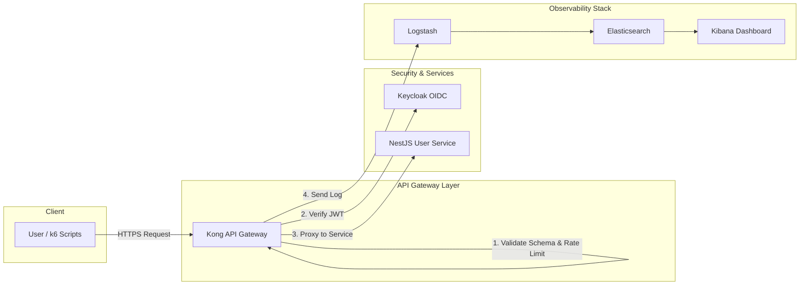

# API Gateway Security Service

Một dự án mẫu trình diễn kiến trúc bảo mật API hiện đại, sử dụng Kong Gateway, Keycloak và ELK Stack để tạo ra một lớp bảo vệ trung tâm, chống lại các mối đe dọa phổ biến và cung cấp khả năng giám sát toàn diện.

## ✨ Tính năng nổi bật

- **🛡️ Lớp bảo vệ trung tâm:** Mọi API đều được bảo vệ bởi Kong API Gateway.
- **🔑 Xác thực & Phân quyền chuẩn hóa:** Tích hợp với Keycloak sử dụng chuẩn OpenID Connect (OIDC) và JWT.
- **💥 Chống tấn công Brute-Force:** Áp dụng Rate Limiting chặt chẽ trên các endpoint nhạy cảm (ví dụ: `/auth/login`).
- **📝 Ngăn chặn dữ liệu không hợp lệ:** Tự động xác thực payload của request dựa trên định nghĩa OpenAPI Schema.
- **📈 Giám sát và Phân tích tập trung:** Toàn bộ lưu lượng API được ghi log, làm giàu (enrich) và đẩy vào ELK Stack (Elasticsearch, Logstash, Kibana) để trực quan hóa và phát hiện bất thường.
- **🌍 Phân tích địa lý (GeoIP):** Tự động xác định vị trí của client dựa trên địa chỉ IP để phát hiện các truy cập đáng ngờ.

## 🚀 Kiến trúc hệ thống

Dự án được xây dựng dựa trên kiến trúc microservice, với các thành phần chính được đóng gói bằng Docker.



| Thành phần | Vai trò | Ghi chú |
| --- | --- | --- |
| **Kong Gateway** | Lớp chắn API, thực thi các chính sách bảo mật. | DB-less, cấu hình tại `kong/kong.yml`. |
| **Keycloak** | Identity Provider, cấp phát và xác thực token JWT. | Realm `demo`, user `demo/demo123`. |
| **NestJS Service** | API mẫu (`/auth/login`, `/api/me`). | Logic nghiệp vụ chính. |
| **ELK Stack** | Thu thập, lưu trữ và trực quan hóa log. | Pipeline xử lý log thông minh tại `logstash.conf`. |
| **k6 Scripts** | Công cụ kiểm thử hiệu năng và an ninh. | Mô phỏng kịch bản hợp lệ và tấn công brute-force. |

## 🛠️ Công nghệ sử dụng


## ⚙️ Hướng dẫn cài đặt và sử dụng

### Yêu cầu
- Docker & Docker Compose v2
- k6 (https://k6.io) để thực hiện kiểm thử tải

### 1. Khởi chạy hệ thống
```bash
# Build và khởi chạy toàn bộ các service ở chế độ nền
docker compose up -d --build

# Kiểm tra trạng thái các container
docker compose ps
```
> **Lưu ý:** Hệ thống có thể mất khoảng 1-2 phút để khởi động hoàn toàn, đặc biệt là Keycloak và Elasticsearch.

### 2. Kiểm tra nhanh (Smoke Test)
```bash
# a. Đăng nhập để nhận Access Token
TOKEN=$(curl -s -X POST http://localhost:8000/auth/login \
  -H "Content-Type: application/json" \
  -d '{"username":"demo","password":"demo123"}' | jq -r .access_token)

echo "Access Token: $TOKEN"

# b. Gọi API được bảo vệ với token vừa nhận
curl -s http://localhost:8000/api/me -H "Authorization: Bearer $TOKEN" | jq
```

### 3. Kiểm thử an ninh với k6
Các kịch bản kiểm thử được thiết kế để so sánh hiệu năng và khả năng bảo vệ khi chạy qua Gateway (`MODE=gw`) và khi gọi trực tiếp service (`MODE=base`).

```bash
# Kịch bản 1: Tải hợp lệ (đăng nhập và gọi API)
# So sánh overhead của Gateway
MODE=gw k6 run k6/valid.js

# Kịch bản 2: Tấn công Brute-Force (thử mật khẩu sai liên tục)
# Chứng minh khả năng chống tấn công của Gateway
MODE=gw k6 run k6/brute.js
```
Khi chạy kịch bản 2, bạn sẽ thấy Kong trả về lỗi `HTTP 429 Too Many Requests` sau một vài lần thử, trong khi service backend nếu gọi trực tiếp sẽ luôn trả về `HTTP 401`.

## 📊 Quan sát trên Kibana

1.  Truy cập Kibana Dashboard tại: http://localhost:5601
2.  Vào **Management > Stack Management > Kibana > Data Views**.
3.  Tạo Data View với pattern `kong-logs-*` và trường thời gian là `@timestamp`.
4.  Bắt đầu khám phá và xây dựng biểu đồ để theo dõi:
    -   Lưu lượng request theo status code (đặc biệt là `429` và `401`).
    -   Các IP có truy cập bất thường.
    -   Phân bố địa lý của các request.

## 📁 Cấu trúc thư mục
```
.
├── docker-compose.yml        # Định nghĩa và kết nối các service
├── kong/
│   └── kong.yml              # Cấu hình routes và các plugin bảo mật
├── keycloak/
│   └── realm-export.json     # Dữ liệu mẫu cho Keycloak (realm, user, client)
├── usersvc/
│   ├── openapi.yml           # Định nghĩa OpenAPI Schema cho validation
│   └── src/                  # Mã nguồn NestJS service
├── logstash/
│   └── pipeline/logstash.conf# Pipeline xử lý và làm giàu log
└── k6/
    ├── valid.js              # Kịch bản kiểm thử hợp lệ
    └── brute.js              # Kịch bản mô phỏng tấn công brute-force
```

## 🔚 Dọn dẹp
```bash
# Dừng và xóa toàn bộ container
docker compose down

# (Tùy chọn) Xóa cả volume dữ liệu (database, logs)
docker compose down -v
