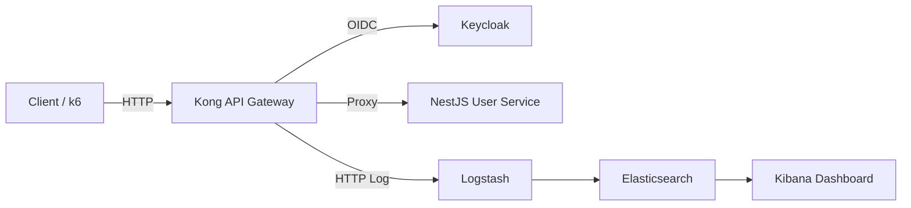

# API Gateway Security Service – Student Project

> Đồ án mẫu bảo vệ API trước brute-force, abuse và giúp quan sát lưu lượng theo yêu cầu phạm vi bắt buộc của nhóm.

## 1. Tổng quan hệ thống



| Thành phần | Vai trò | Ghi chú |
| --- | --- | --- |
| Kong Gateway 3.7 | Lớp chắn API, giới hạn tốc độ, ghi log HTTP | DB-less, cấu hình tại `kong/kong.yml` |
| Keycloak 26 + Postgres 15 | Cấp phát token OIDC/JWT | Realm `demo`, user `demo/demo123`, client public `usersvc-client` |
| NestJS User Service | API mẫu `/auth/login`, `/api/me` | Xác thực qua Keycloak, bật validation & logging |
| Logstash 8.15 | Nhận log từ Kong, enrich và đẩy vào ES | Pipeline tại `logstash/pipeline/logstash.conf` |
| Elasticsearch 8.15 | Lưu trữ log phân tích | Single node, tắt xpack cho môi trường lab |
| Kibana 8.15 | Dashboard quan sát API | Data view `kong-logs-*` |
| k6 scripts | Kiểm thử tải (valid & brute force) | `k6/valid.js`, `k6/brute.js` |

## 2. Chuẩn bị môi trường

- Docker Engine + Docker Compose v2
- Node.js 20 (nếu muốn chạy `usersvc` cục bộ)
- k6 (https://k6.io) để thực hiện bài đo tải

## 3. Khởi chạy hệ thống

```bash
# 1) Build & start toàn bộ stack (mất ~1 phút cho Keycloak + Elasticsearch khởi động)
docker compose up -d --build

# 2) Kiểm tra trạng thái container
docker compose ps
```

> Nếu Keycloak chưa import realm (không thấy user `demo`), chạy `docker compose restart keycloak` rồi chờ thêm ~30 giây.

### 3.1. Smoke test thủ công

```bash
# Đăng nhập qua Gateway => nhận access token
curl -s http://localhost:8000/auth/login \
  -H "Content-Type: application/json" \
  -d '{"username":"demo","password":"demo123"}'

# Gọi API me (thay TOKEN ở trên)
curl -s http://localhost:8000/api/me \
  -H "Authorization: Bearer TOKEN"
```

Kết quả kỳ vọng: request đầu trả về `access_token`, request thứ hai trả về thông tin người dùng (`preferred_username`, `email`). Đồng thời log Kong sẽ xuất hiện trong Kibana sau vài giây.

## 4. Kiểm thử tải với k6

Các script dùng biến môi trường `MODE` để chọn chạy trực tiếp service (`MODE=base`) hoặc qua Kong (`MODE=gw`). Khuyến nghị thao tác theo bảng sau để có số liệu so sánh đưa vào báo cáo.

```bash
# 1) Kịch bản hợp lệ (đăng nhập thành công rồi gọi /api/me)
MODE=base k6 run k6/valid.js
MODE=gw   k6 run k6/valid.js

# 2) Kịch bản brute force (thử mật khẩu sai liên tục)
MODE=base k6 run k6/brute.js
MODE=gw   k6 run k6/brute.js
```

Ghi lại kết quả chính trong báo cáo:

| Kịch bản | Trung bình RPS | % Check Pass | Ghi chú |
| --- | --- | --- | --- |
| valid – MODE=base | ... | ... | Benchmark trực tiếp service |
| valid – MODE=gw | ... | ... | Expect 200, chứng minh overhead Gateway thấp |
| brute – MODE=base | ... | ... | Backend trả 401, không giới hạn |
| brute – MODE=gw | ... | ... | Kong trả 429 sau vài request vì rate limit |

## 5. Quan sát log trên Kibana

1. Truy cập http://localhost:5601
2. Tạo Data View mới với pattern `kong-logs-*`, trường thời gian `@timestamp`
3. Tạo 2 visualization cơ bản (Lens):
   - **Throughput theo status**: dùng `event.status` làm break down để thấy 429 tăng khi chạy brute force.
   - **Tỉ lệ rate-limit**: metric `Count`, filter `event.blocked : "rate_limit"`.
4. Lắp 2 visualization vào Dashboard “Kong Gateway Overview” rồi chụp ảnh minh họa cho báo cáo/slide.

> Logstash pipeline đã chuẩn hóa các trường chính (`event.status`, `event.blocked`, `event.latency_*`). Nếu muốn bổ sung GeoIP hoặc mask thông tin nhạy cảm có thể chỉnh sửa tại `logstash/pipeline/logstash.conf`.

## 6. Cấu trúc thư mục

```
.
├── docker-compose.yml        # Khởi tạo toàn bộ stack
├── kong/
│   └── kong.yml              # Cấu hình routes, plugin rate limiting + http log
├── keycloak/
│   └── realm-export.json     # Realm demo: user, client, policy cơ bản
├── usersvc/
│   ├── src/                  # NestJS service mẫu bảo vệ bởi Keycloak
│   └── Dockerfile            # Build image Node.js 20 alpine
├── logstash/
│   └── pipeline/logstash.conf# Parser log Kong -> Elasticsearch
└── k6/
    ├── valid.js              # Happy path (login + me)
    └── brute.js              # Credential stuffing giả lập
```

## 7. Checklist bàn giao đồ án

- [ ] Ghi lại log chạy `docker compose up` và ảnh dashboard Kibana trong báo cáo.
- [ ] Lưu bảng kết quả k6 (4 dòng như hướng dẫn) và phân tích ý nghĩa.
- [ ] Mô tả luồng xác thực JWT / Keycloak và cơ chế rate limiting của Kong.
- [ ] Nêu rõ hạn chế (chưa bật TLS, chưa có Redis) và đề xuất hướng phát triển (từ mục mở rộng).
- [ ] Chuẩn bị demo: chạy `k6/brute.js` ở `MODE=gw` để trình bày cảnh rate-limit.

## 8. Gỡ lỗi nhanh

| Sự cố | Nguyên nhân thường gặp | Cách xử lý |
| --- | --- | --- |
| `401 Unauthorized` khi gọi `/api/me` | Không gửi header `Authorization` hoặc token hết hạn | Chạy lại `/auth/login` để lấy token mới |
| `429 Too Many Requests` ngay khi login | Đang chạy k6 brute force hoặc lặp lại request quá nhanh | Chờ 1 phút cho quota đặt lại |
| Kibana không thấy data view | Logstash chưa nhận log, kiểm tra container `logstash` | `docker compose logs logstash`, đảm bảo Kong plugin `http-log` hoạt động |

> Khi kết thúc buổi demo, dừng toàn bộ stack bằng `docker compose down` (thêm `-v` nếu muốn xóa volume dữ liệu).
