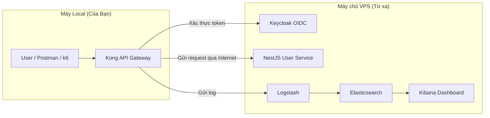

# API Gateway Security Service

Một dự án mẫu trình diễn kiến trúc bảo mật API hiện đại, sử dụng Kong Gateway, Keycloak và ELK Stack để tạo ra một lớp bảo vệ trung tâm, chống lại các mối đe dọa phổ biến và cung cấp khả năng giám sát toàn diện.

## ✨ Tính năng nổi bật

- **🛡️ Lớp bảo vệ trung tâm:** Mọi API đều đi qua Kong API Gateway trước khi tới backend.
- **🔑 Chuẩn hóa xác thực JWT:** Kong kiểm tra chữ ký token Keycloak bằng plugin `jwt`.
- **💥 Chống tấn công Brute-Force:** Áp dụng Rate Limiting chặt chẽ trên các endpoint nhạy cảm.
- **📝 Ràng buộc payload:** Sử dụng `pre-function` (Lua) để kiểm tra cấu trúc request ngay tại gateway.
- **📈 Giám sát và Phân tích tập trung:** Toàn bộ lưu lượng API được đẩy vào ELK Stack để phân tích và trực quan hóa.
- **🌍 Phân tích địa lý (GeoIP):** Tự động xác định vị trí của client dựa trên địa chỉ IP.

## 🚀 Kiến trúc triển khai (Mô hình Hybrid)

Để tối ưu hiệu năng và mô phỏng môi trường thực tế, dự án được triển khai theo mô hình Hybrid:
- **Máy chủ VPS (Từ xa):** Chạy các dịch vụ "nặng" như Keycloak, User Service và ELK Stack.
- **Máy Local (Máy thật):** Chỉ chạy thành phần nhẹ là Kong API Gateway.



## 🛠️ Công nghệ sử dụng


## 📚 Tài liệu chi tiết

Để có hướng dẫn đầy đủ và chi tiết nhất, vui lòng tham khảo các tài liệu sau:

- **[PROJECT_GUIDE.md](./PROJECT_GUIDE.md):** **(Bắt đầu từ đây)** Cẩm nang toàn diện về dự án, bao gồm hướng dẫn cài đặt, kịch bản demo chi tiết và chiến lược báo cáo.
- **[SETUP_REMOTE_INFRA.md](./SETUP_REMOTE_INFRA.md):** Hướng dẫn chi tiết các bước cài đặt và cấu hình máy chủ VPS từ A-Z.
- **[POSTMAN_TESTING_GUIDE.md](./POSTMAN_TESTING_GUIDE.md):** Hướng dẫn các kịch bản kiểm thử bảo mật bằng Postman.
- **[KIBANA_GUIDE.md](./KIBANA_GUIDE.md):** Hướng dẫn cách sử dụng Kibana để giám sát và phân tích log.

## ⚙️ Bắt đầu nhanh

1.  **Trên VPS:** Làm theo hướng dẫn trong `SETUP_REMOTE_INFRA.md` để khởi chạy các dịch vụ nền.
2.  **Trên máy Local:**
    *   Cấu hình file `kong/kong.yml` để trỏ đến IP của VPS.
    *   Chạy Kong Gateway bằng lệnh:
        ```bash
        docker compose -f docker-compose.kong-only.yml up -d --build
        ```
3.  **Kiểm thử:** Làm theo các kịch bản trong `POSTMAN_TESTING_GUIDE.md`.

Để có hướng dẫn chi tiết hơn, vui lòng xem **[PROJECT_GUIDE.md](./PROJECT_GUIDE.md)**.

## 📁 Cấu trúc thư mục chính

```
.
├── PROJECT_GUIDE.md          # Cẩm nang chính của dự án
├── SETUP_REMOTE_INFRA.md     # Hướng dẫn cài đặt VPS
├── POSTMAN_TESTING_GUIDE.md  # Kịch bản test với Postman
├── KIBANA_GUIDE.md           # Hướng dẫn sử dụng Kibana
├── docker-compose.yml        # Định nghĩa các service chạy trên VPS
├── docker-compose.kong-only.yml # Định nghĩa service Kong chạy local
├── kong/                     # Cấu hình Kong Gateway
├── keycloak/                 # Cấu hình Keycloak Realm
├── usersvc/                  # Mã nguồn NestJS service
├── logstash/                 # Cấu hình Logstash pipeline
└── k6/                       # Kịch bản kiểm thử hiệu năng
