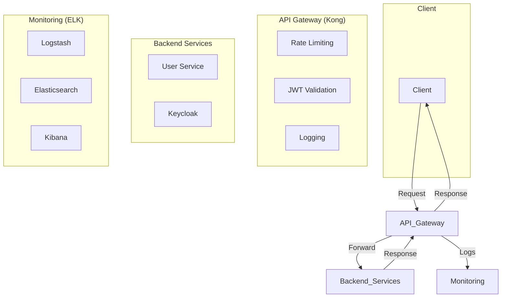

# API Gateway Security Service

Một dự án mẫu trình diễn kiến trúc bảo mật API hiện đại, sử dụng Kong Gateway, Keycloak và ELK Stack để tạo ra một lớp bảo vệ trung tâm, chống lại các mối đe dọa phổ biến và cung cấp khả năng giám sát toàn diện.

---

## 1. Bối Cảnh & Vấn Đề

Ngày nay, API là xương sống của hầu hết các ứng dụng hiện đại. Tuy nhiên, chúng cũng là mục tiêu tấn công hàng đầu. Dự án này được xây dựng để giải quyết các vấn đề thực tế:
- **Tấn công Brute-Force:** Theo Kaspersky, Việt Nam đứng đầu Đông Nam Á về tấn công "vét cạn" (brute-force) năm 2024.
- **Lỗ hổng bảo mật:** Các backend service thường thiếu các lớp bảo vệ chuyên biệt, dễ bị tấn công bởi dữ liệu không hợp lệ.
- **Thiếu khả năng giám sát:** Khi sự cố xảy ra, việc điều tra và truy vết rất khó khăn do log phân tán.

---

## 2. Kiến Trúc Giải Pháp (Mô Hình Hybrid)

Để tối ưu hiệu năng và mô phỏng môi trường triển khai thực tế, dự án được triển khai theo mô hình **Hybrid**:
- **Máy chủ VPS (Từ xa):** Chạy các dịch vụ "nặng" như Keycloak, User Service và bộ ELK Stack.
- **Máy Local (Máy thật):** Chỉ chạy thành phần nhẹ là Kong API Gateway, đóng vai trò là cổng vào duy nhất cho mọi request từ client.



### Luồng Xác Thực Chi Tiết
Đây là luồng hoạt động chuẩn của hệ thống sau khi đã được tinh chỉnh:
1.  **Đăng nhập:** Client gửi `username` & `password` đến Kong. Kong chuyển tiếp đến `usersvc`.
2.  **Lấy Token:** `usersvc` **không tự tạo token**. Thay vào đó, nó dùng thông tin đăng nhập để gọi đến Keycloak và nhận về một `access_token` hợp lệ.
3.  **Trả Token:** `usersvc` trả `access_token` (do Keycloak cấp) về cho client.
4.  **Truy cập API:** Client dùng token này để gọi các API được bảo vệ. Kong sẽ xác thực token này với public key của Keycloak, đảm bảo `iss` (issuer) luôn hợp lệ.

---

## 3. Các Lớp Bảo Mật Chính

- **🛡️ Lớp 1: Gateway (Kong)**
  - **Xác thực JWT:** Đảm bảo mọi request đến các API được bảo vệ phải có token hợp lệ do Keycloak phát hành. Kong sẽ kiểm tra chữ ký và thời hạn của token.
  - **Chống Brute-Force:** Áp dụng Rate Limiting (giới hạn 5 request/giây) trên endpoint đăng nhập để chống tấn công "vét cạn".
  - **Validation Payload:** Dùng script Lua để kiểm tra cấu trúc và định dạng dữ liệu đầu vào ngay tại gateway, trước khi request chạm tới backend.
- **📈 Lớp 2: Giám Sát (ELK Stack)**
  - **Logging Tập Trung:** Mọi request đi qua Kong (thành công hay thất bại) đều được ghi log và đẩy về Logstash qua cổng `5044`.
  - **Làm giàu Dữ liệu:** Logstash xử lý, trích xuất thông tin quan trọng (status, IP, latency) và thêm dữ liệu vị trí địa lý (GeoIP).
  - **Trực quan hóa:** Kibana cung cấp giao diện để tìm kiếm, lọc và tạo biểu đồ từ log, giúp phát hiện tấn công trong thời gian thực.

---

## 4. Hướng Dẫn Cài Đặt và Vận Hành

### Cấu hình IP dùng chung (mới)
- Tạo file `.env` từ mẫu:
  - Sao chép `.env.example` thành `.env` và cập nhật biến `PUBLIC_IP`.
  - `PUBLIC_IP` là IP public hoặc domain của VPS (không kèm http/https). Ví dụ: `13.250.36.84` hoặc `api.example.com`.
- Trước khi chạy Kong, render cấu hình từ template:
  - PowerShell: chạy `scripts/render-kong.ps1` để tạo `kong/kong.yml` từ `kong/kong.yml.tmpl` bằng IP trong `.env`.
  - `docker-compose.yml` đã tham chiếu `${PUBLIC_IP}` cho `KEYCLOAK_REALM_URL` và `KC_HOSTNAME`.

#### Script tiện ích (tùy chọn)
- Có sẵn script hợp nhất thao tác: `scripts/update-kong.ps1`
  - Chức năng: đảm bảo `.env` tồn tại (tự copy từ `.env.example` nếu thiếu hoặc tạo tối thiểu), tùy chọn đặt `PUBLIC_IP`, và render `kong/kong.yml`.
  - Chạy mặc định (đảm bảo `.env` và render):
    ```powershell
    pwsh -File .\scripts\update-kong.ps1
    ```
  - Đặt IP trực tiếp và render (không cần mở file):
    ```powershell
    pwsh -File .\scripts\update-kong.ps1 -PublicIp 54.179.69.194
    ```

  - Linux/Ubuntu (bash) tương đương:
    ```bash
    # Đảm bảo .env và render
    bash ./scripts/update-kong.sh

    # Đặt IP trực tiếp và render
    bash ./scripts/update-kong.sh --public-ip 54.179.69.194
    ```

- Lệnh chạy powershell:
  ```powershell
  # Chạy trong PowerShell ở thư mục gốc của dự án
  pwsh -NoProfile -ExecutionPolicy Bypass -File "scripts\update-kong.ps1"
  ```

  ```bash
  # Chạy trên Ubuntu (bash) ở thư mục gốc của dự án
  bash ./scripts/update-kong.sh
  ```

### Bước 1: Cài Đặt Trên Máy Chủ VPS
Đây là nơi chạy các dịch vụ backend.

1.  **Chuẩn bị VPS:** Chuẩn bị một máy chủ Ubuntu và mở các cổng `3000`, `8080`, `8081`, `9200`, `5601`, và `5044`.
2.  **Cài Docker & Tải Mã Nguồn:** Cài đặt Docker, Docker Compose và clone repository này về VPS.
3.  **Khởi chạy Dịch Vụ Nền:** Chạy lệnh sau trên VPS để khởi động tất cả các dịch vụ backend:
    ```bash
    docker compose up -d
    ```
4.  **Kiểm Tra:** Dùng `docker compose ps` để đảm bảo tất cả các service (usersvc, keycloak, elasticsearch,...) đã `healthy`. Ghi lại địa chỉ **IP Public của VPS**.

### Bước 2: Cài Đặt Trên Máy Local
Đây là nơi chỉ chạy Kong API Gateway.

1.  **Đặt IP một lần:** Sửa `PUBLIC_IP` trong file `.env` ở thư mục gốc.
2.  **Render cấu hình Kong:** Chạy script PowerShell `scripts/render-kong.ps1` để sinh `kong/kong.yml` từ template.
3.  **Khởi chạy Kong:** Sử dụng file `docker-compose.kong-only.yml`:
    ```bash
    docker compose -f docker-compose.kong-only.yml up -d --force-recreate
    ```
    *(Sử dụng `--force-recreate` để đảm bảo Kong luôn áp dụng cấu hình mới nhất từ `kong.yml`)*.

### Bước 3: Kiểm Thử Với Postman
> 📖 **Lưu ý:** Để có hướng dẫn chi tiết từng bước trên Postman, vui lòng xem file **[POSTMAN_TESTING_GUIDE.md](./POSTMAN_TESTING_GUIDE.md)**.

1.  **Đăng nhập thành công:** Gửi request `POST` đến `http://localhost:8000/auth/login` với `username` và `password` để nhận `access_token` do Keycloak cấp.
2.  **Truy cập API được bảo vệ:** Gửi request `GET` đến `http://localhost:8000/api/me` với `Authorization: Bearer <token>` để lấy thông tin người dùng.

---

## 5. Demo Các Kịch Bản Bảo Mật

- **Kịch bản 1: Tấn công Brute-Force**
  - **Hành động:** Gửi request đăng nhập với mật khẩu sai liên tục.
  - **Kết quả:** Sau vài lần `401 Unauthorized`, bạn sẽ nhận được `429 Too Many Requests`. **Cơ chế Rate Limiting đã hoạt động.**

- **Kịch bản 2: Gửi Dữ Liệu Sai Định Dạng**
  - **Hành động:** Gửi request đăng nhập thiếu trường `password`.
  - **Kết quả:** Bạn sẽ nhận được `400 Bad Request`. **Cơ chế Validation Payload đã hoạt động.**

- **Kịch bản 3: Giám Sát Tấn Công Trên Kibana**
  - **Hành động:** Truy cập Kibana trên VPS (`http://<IP_VPS>:5601`).
  - **Kết quả:**
    - Vào **Discover**, bạn có thể tìm kiếm và lọc các log có `http.response.status_code: 429` để thấy chính xác các request đã bị chặn bởi Rate Limiting.
    - Bạn có thể tạo biểu đồ để trực quan hóa tỷ lệ các loại lỗi.
  > 📖 **Lưu ý:** Để có hướng dẫn chi tiết về cách tạo Data View và Visualize, vui lòng xem file **[POSTMAN_KIBANA_GUIDE.md](./POSTMAN_KIBANA_GUIDE.md)**.

---

## 6. Tài Liệu Tham Khảo Thêm

- **[FINAL_CHECKLIST.md](./FINAL_CHECKLIST.md):** Checklist cuối cùng trước khi báo cáo.
- **[HUONG_DAN_CHAY_PROJECT.md](./HUONG_DAN_CHAY_PROJECT.md):** Hướng dẫn vận hành tóm tắt.
- **[POSTMAN_TESTING_GUIDE.md](./POSTMAN_TESTING_GUIDE.md):** Hướng dẫn kiểm thử bằng Postman.
- **[POSTMAN_KIBANA_GUIDE.md](./POSTMAN_KIBANA_GUIDE.md):** Hướng dẫn sử dụng Kibana.
