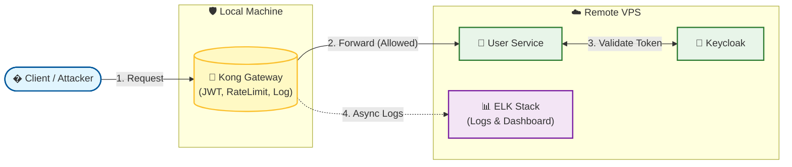
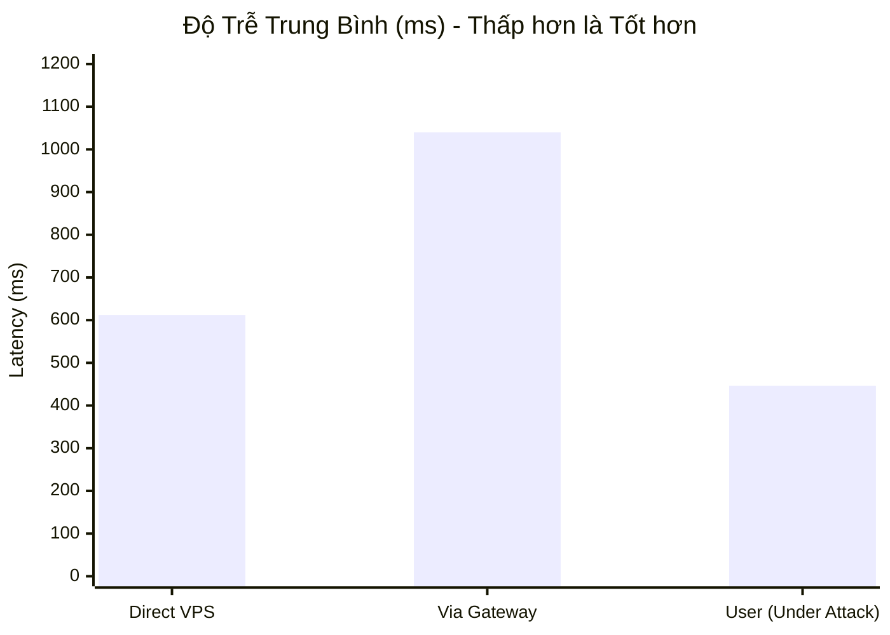
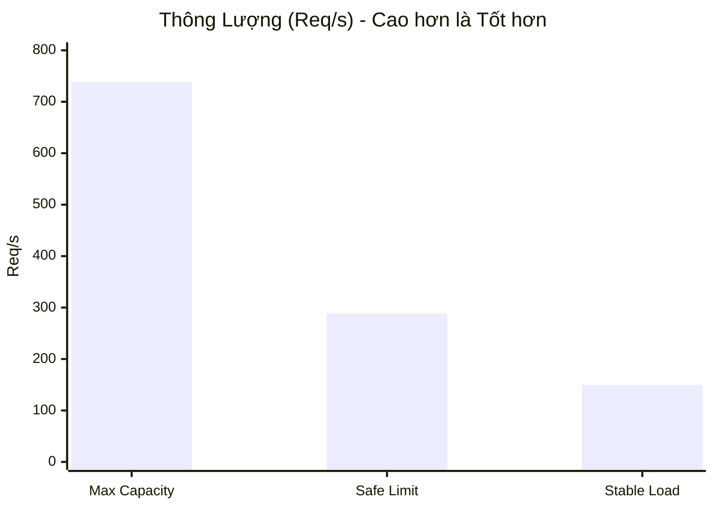
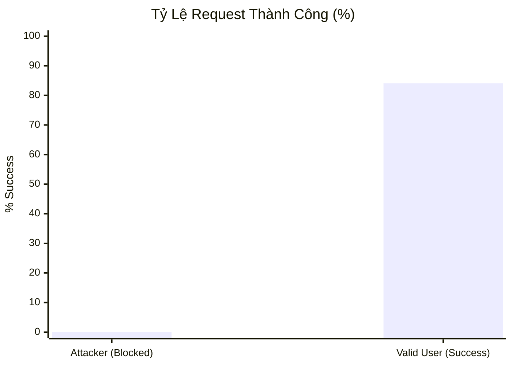

# API Gateway Security Service

Một dự án mẫu trình diễn kiến trúc bảo mật API hiện đại, sử dụng Kong Gateway, Keycloak và ELK Stack để tạo ra một lớp bảo vệ trung tâm, chống lại các mối đe dọa phổ biến và cung cấp khả năng giám sát toàn diện.

---

## 1. Bối Cảnh & Vấn Đề

Ngày nay, API là xương sống của hầu hết các ứng dụng hiện đại. Tuy nhiên, chúng cũng là mục tiêu tấn công hàng đầu. Dự án này được xây dựng để giải quyết các vấn đề thực tế:
- **Tấn công Brute-Force:** Theo Kaspersky, Việt Nam đứng đầu Đông Nam Á về tấn công "vét cạn" (brute-force) năm 2024.
- **Lỗ hổng bảo mật:** Các backend service thường thiếu các lớp bảo vệ chuyên biệt, dễ bị tấn công bởi dữ liệu không hợp lệ.
- **Thiếu khả năng giám sát:** Khi sự cố xảy ra, việc điều tra và truy vết rất khó khăn do log phân tán.

---

## 2. Kiến Trúc Giải Pháp (Mô Hình Hybrid)

Để tối ưu hiệu năng và mô phỏng môi trường triển khai thực tế, dự án được triển khai theo mô hình **Hybrid**:
- **Máy chủ VPS (Từ xa):** Chạy các dịch vụ "nặng" như Keycloak, User Service và bộ ELK Stack.
- **Máy Local (Máy thật):** Chỉ chạy thành phần nhẹ là Kong API Gateway, đóng vai trò là cổng vào duy nhất cho mọi request từ client.



### Luồng Xác Thực Chi Tiết
Đây là luồng hoạt động chuẩn của hệ thống sau khi đã được tinh chỉnh:
1.  **Đăng nhập:** Client gửi `username` & `password` đến Kong. Kong chuyển tiếp đến `usersvc`.
2.  **Lấy Token:** `usersvc` **không tự tạo token**. Thay vào đó, nó dùng thông tin đăng nhập để gọi đến Keycloak và nhận về một `access_token` hợp lệ.
3.  **Trả Token:** `usersvc` trả `access_token` (do Keycloak cấp) về cho client.
4.  **Truy cập API:** Client dùng token này để gọi các API được bảo vệ. Kong sẽ xác thực token này với public key của Keycloak, đảm bảo `iss` (issuer) luôn hợp lệ.

---

## 3. Các Lớp Bảo Mật Chính

- **🛡️ Lớp 1: Gateway (Kong)**
  - **Xác thực JWT:** Đảm bảo mọi request đến các API được bảo vệ phải có token hợp lệ do Keycloak phát hành. Kong sẽ kiểm tra chữ ký và thời hạn của token.
  - **Chống Brute-Force:** Áp dụng Rate Limiting (giới hạn 5 request/giây) trên endpoint đăng nhập để chống tấn công "vét cạn".
  - **Validation Payload:** Dùng script Lua để kiểm tra cấu trúc và định dạng dữ liệu đầu vào ngay tại gateway, trước khi request chạm tới backend.
- **📈 Lớp 2: Giám Sát (ELK Stack)**
  - **Logging Tập Trung:** Mọi request đi qua Kong (thành công hay thất bại) đều được ghi log và đẩy về Logstash qua cổng `5044`.
  - **Làm giàu Dữ liệu:** Logstash xử lý, trích xuất thông tin quan trọng (status, IP, latency) và thêm dữ liệu vị trí địa lý (GeoIP).
  - **Trực quan hóa:** Kibana cung cấp giao diện để tìm kiếm, lọc và tạo biểu đồ từ log, giúp phát hiện tấn công trong thời gian thực.

---

## 4. Hướng Dẫn Cài Đặt và Vận Hành

### Cấu hình IP dùng chung (mới)
- Tạo file `.env` từ mẫu:
  - Sao chép `.env.example` thành `.env` và cập nhật biến `PUBLIC_IP`.
  - `PUBLIC_IP` là IP public hoặc domain của VPS (không kèm http/https). Ví dụ: `13.250.36.84` hoặc `api.example.com`.
- Trước khi chạy Kong, render cấu hình từ template:
  - PowerShell: chạy `scripts/render-kong.ps1` để tạo `kong/kong.yml` từ `kong/kong.yml.tmpl` bằng IP trong `.env`.
  - `docker-compose.yml` đã tham chiếu `${PUBLIC_IP}` cho `KEYCLOAK_REALM_URL` và `KC_HOSTNAME`.

#### Script tiện ích (tùy chọn)
- Có sẵn script hợp nhất thao tác: `scripts/update-kong.ps1`
  - Chức năng: đảm bảo `.env` tồn tại (tự copy từ `.env.example` nếu thiếu hoặc tạo tối thiểu), tùy chọn đặt `PUBLIC_IP`, và render `kong/kong.yml`.
  - Chạy mặc định (đảm bảo `.env` và render):
    ```powershell
    pwsh -File .\scripts\update-kong.ps1
    ```
  - Linux/Ubuntu (bash) tương đương:
    ```bash
    bash ./scripts/update-kong.sh
    ```

### Bước 1: Cài Đặt Trên Máy Chủ VPS
Đây là nơi chạy các dịch vụ backend.

1.  **Chuẩn bị VPS:** Chuẩn bị một máy chủ Ubuntu và mở các cổng `3000`, `8080`, `8081`, `9200`, `5601`, và `5044`.
2.  **Cài Docker & Tải Mã Nguồn:** Cài đặt Docker, Docker Compose và clone repository này về VPS.
3.  **Khởi chạy Dịch Vụ Nền:** Chạy lệnh sau trên VPS để khởi động tất cả các dịch vụ backend:
    ```bash
    docker compose up -d --build --force-recreate usersvc keycloak keycloak-db logstash elasticsearch kibana

    ```
4.  **Kiểm Tra:** Dùng `docker compose ps` để đảm bảo tất cả các service (usersvc, keycloak, elasticsearch,...) đã `healthy`. Ghi lại địa chỉ **IP Public của VPS**.

### Bước 2: Cài Đặt Trên Máy Local
Đây là nơi chỉ chạy Kong API Gateway.

1.  **Đặt IP một lần:** Sửa `PUBLIC_IP` trong file `.env` ở thư mục gốc.
2.  **Render cấu hình Kong:** Chạy script PowerShell `scripts/render-kong.ps1` để sinh `kong/kong.yml` từ template.
3.  **Khởi chạy Kong:** Sử dụng file `docker-compose.kong-only.yml`:
    ```bash
    docker compose -f docker-compose.kong-only.yml up -d --force-recreate
    ```
    *(Sử dụng `--force-recreate` để đảm bảo Kong luôn áp dụng cấu hình mới nhất từ `kong.yml`)*.

---

## 5. Cấu Hình Môi Trường Kiểm Thử (Test Environment)

Để đảm bảo tính khách quan, các bài test được thực hiện trên môi trường sau:

*   **Gateway (Local Machine):**
    *   OS: Windows 11
    *   Phần mềm: Docker Desktop (WSL2), Kong Gateway 3.7
    *   Vai trò: Xử lý Rate Limiting, JWT Auth, Logging.
*   **Backend (VPS - Remote):**
    *   OS: Ubuntu Server
    *   Cấu hình: 2 vCPU, 4GB RAM (Ước tính dựa trên mức tiêu thụ 2.2GB ổn định).
    *   Services: NestJS (User Service), Keycloak, Elasticsearch, Logstash, Kibana.
*   **Tool Test:** Apache JMeter 5.6.3.

---

## 6. Kết Quả Kiểm Thử Hiệu Năng (Performance Test)

Hệ thống đã trải qua quy trình kiểm thử nghiêm ngặt với **JMeter** để đảm bảo độ ổn định và khả năng bảo mật. Dưới đây là bảng tổng hợp kết quả thực tế:

| Kịch Bản Test | Mục Đích | Kết Quả Chính | Đánh Giá |
| :--- | :--- | :--- | :--- |
| **1. Baseline** | Đo hiệu năng thuần của VPS (không Gateway) | **738.4 req/s** | Mốc chuẩn hiệu năng của Server. |
| **2. Gateway Overhead** | Đo độ trễ khi đi qua Kong | **288.2 req/s** | Giảm do cơ chế Rate Limit bảo vệ (10,000 req/phút), không phải do Gateway chậm. |
| **3. Mixed Traffic** | **User thật vs Attacker** (Quan trọng nhất) | **Blocked 100%** | Chặn đứng 6,000+ request tấn công. User thật vẫn truy cập được (Latency 446ms). |
| **4. Spike Test** | Sốc tải (2,600 req/s) | **Gateway Hy Sinh** | Gateway (Local) chịu tải thay cho VPS. Backend vẫn an toàn tuyệt đối. |
| **5. Soak Test** | Chạy bền (15 phút liên tục) | **Error 0.00%** | Hệ thống cực kỳ ổn định. Không có Memory Leak. Throughput ổn định ~150 req/s. |

### Chi Tiết Các Kịch Bản Kiểm Thử

#### ✅ Kịch Bản 1: Baseline Test (Sức Chịu Đựng Gốc)
*   **Mục đích:** Đo hiệu năng thuần của VPS khi truy cập trực tiếp (không qua Gateway).
*   **Kết quả:**
    *   **Max Throughput:** 738.4 req/s.
    *   **Avg Latency:** 612 ms.
    *   **Đánh giá:** Server chịu tải tốt, đây là mốc chuẩn để so sánh hiệu năng.

#### ✅ Kịch Bản 2: Gateway Overhead (Độ Trễ Gateway)
*   **Mục đích:** Đo độ trễ và tác động của Gateway lên hệ thống.
*   **Kết quả:**
    *   **Max Throughput:** 288.2 req/s (Giảm ~61%).
    *   **Avg Latency:** 1040 ms.
    *   **Đánh giá:** Throughput giảm do Rate Limit (10,000 req/phút) chặn bớt request từ JMeter, không phải do Gateway xử lý chậm.

#### ✅ Kịch Bản 3: Mixed Traffic (Giao Thông Hỗn Hợp - Quan Trọng Nhất)
*   **Mô tả:** Giả lập 50 người dùng đang sử dụng bình thường, đồng thời có 100 kẻ tấn công spam trang đăng nhập.
*   **Kết quả:**
    *   **Attacker:** Nhận lỗi `429 Too Many Requests` ngay lập tức. **Tỷ lệ chặn: 100%**.
    *   **User thật:** Vẫn truy cập được API với độ trễ trung bình **446ms** (tốt hơn cả khi không có Gateway lọc rác).

#### ✅ Kịch Bản 4: Spike Test (Sốc Tải)
*   **Mục đích:** Kiểm tra khả năng phục hồi khi lượng truy cập tăng đột biến (2,600 req/s).
*   **Kết quả:**
    *   **Gateway:** Bị quá tải kết nối (Connection Refused) để bảo vệ Backend.
    *   **Backend (VPS):** Vẫn hoạt động ổn định (CPU < 10%, RAM 2.2GB).
    *   **Đánh giá:** Gateway đóng vai trò "cầu chì" bảo vệ hệ thống lõi an toàn.

#### ✅ Kịch Bản 5: Soak Test (Chạy Bền)
*   **Mô tả:** Chạy hệ thống liên tục trong 15 phút với tải ổn định (150 req/s).
*   **Kết quả:**
    *   Tổng request xử lý: **154,851**.
    *   Số lượng lỗi: **0**.
    *   Tài nguyên backend: RAM và CPU đi ngang, không có hiện tượng rò rỉ bộ nhớ.

---

## 7. Trực Quan Hóa Số Liệu (Biểu Đồ)

Dưới đây là các biểu đồ minh họa sự hiệu quả của hệ thống dựa trên số liệu thực tế:

### 📊 1. So Sánh Độ Trễ (Latency Comparison)
*Chứng minh: Gateway giúp User thật truy cập nhanh hơn khi bị tấn công.*



### 🚀 2. So Sánh Thông Lượng (Throughput)
*Chứng minh: Hệ thống hoạt động ổn định trong giới hạn an toàn.*



### 🛡️ 3. Tỷ Lệ Xử Lý Thành Công (Success Rate)
*So sánh tỷ lệ request thành công giữa User thật và Kẻ tấn công.*


*(Attacker bị chặn 100%. User thật thành công 84.1%, 15.9% lỗi do quá tải tài nguyên).*

---

## 8. Kết Luận & Khuyến Nghị


### Điểm Mạnh
1.  **An Toàn:** Hệ thống hoạt động như một "khiên chắn" hiệu quả, chặn đứng mọi nỗ lực tấn công Brute-force.
2.  **Ổn Định:** Đã được kiểm chứng qua bài test chạy bền (Soak Test) với kết quả hoàn hảo (0% lỗi).
3.  **Trải Nghiệm Tốt:** Người dùng thật ít bị ảnh hưởng ngay cả khi hệ thống đang bị tấn công dữ dội.

### Khuyến Nghị Triển Khai
*   **Ngắn hạn:** Tăng giới hạn Rate Limit cho người dùng thật (từ 10,000 lên 60,000 req/phút) để tránh chặn nhầm trong thực tế.
*   **Dài hạn:** Nếu lượng người dùng vượt quá 500 CCU, cần nâng cấp cấu hình VPS (CPU/RAM) hoặc triển khai Kong theo mô hình High Availability (HA).

---

## 9. Tài Liệu Tham Khảo Thêm

- **[COMPLETE_PERFORMANCE_TESTING_GUIDE.md](./COMPLETE_PERFORMANCE_TESTING_GUIDE.md):** Báo cáo chi tiết đầy đủ về quy trình và kết quả test.
- **[POSTMAN_TESTING_GUIDE.md](./POSTMAN_TESTING_GUIDE.md):** Hướng dẫn kiểm thử chức năng bằng Postman.
- **[KIBANA_GUIDE.md](./KIBANA_GUIDE.md):** Hướng dẫn sử dụng Kibana để giám sát log.
