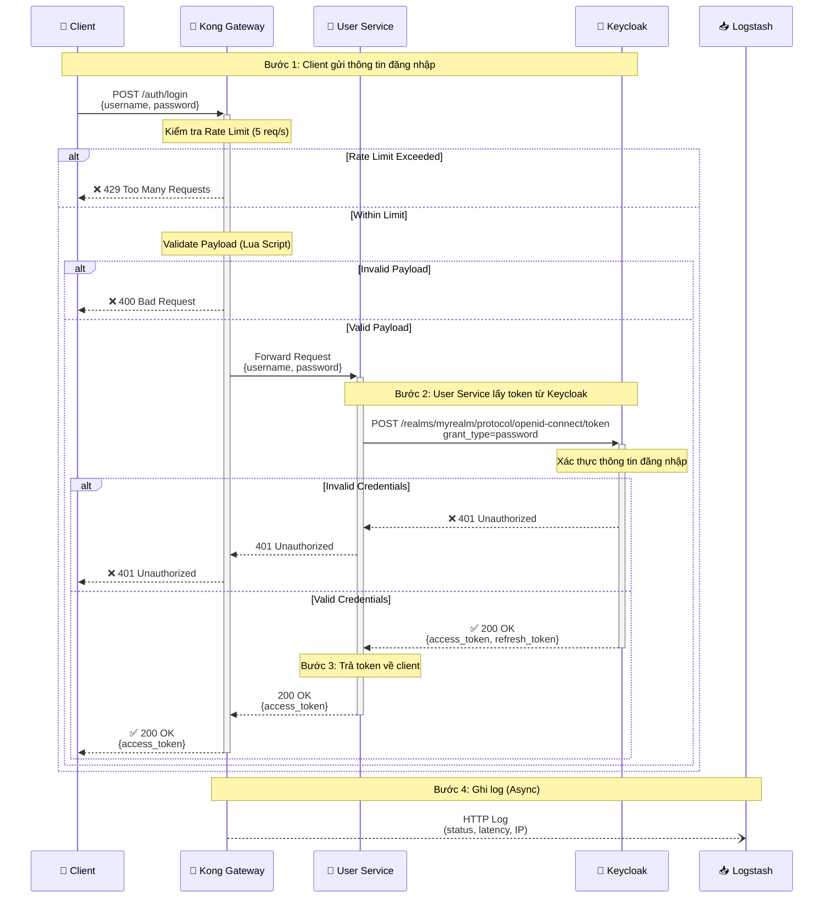
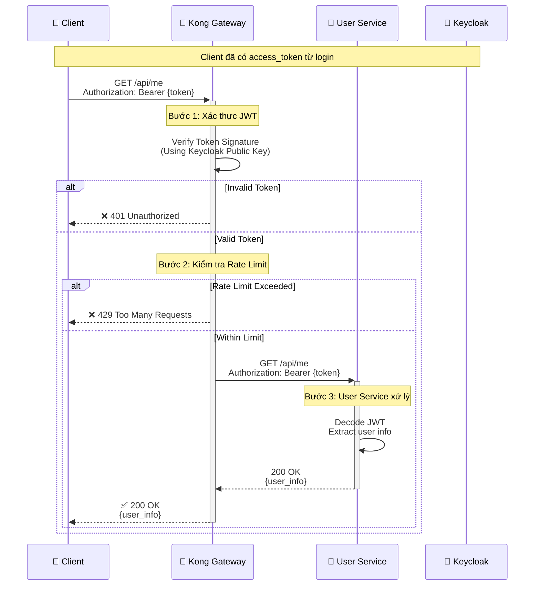
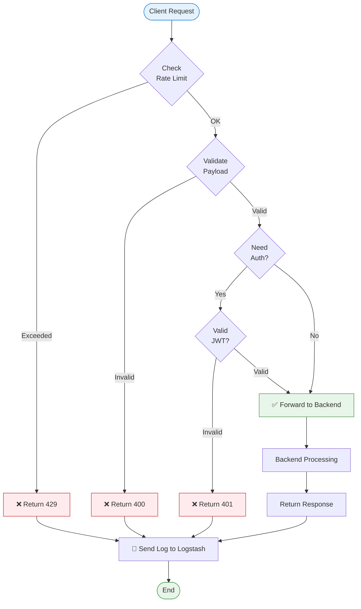
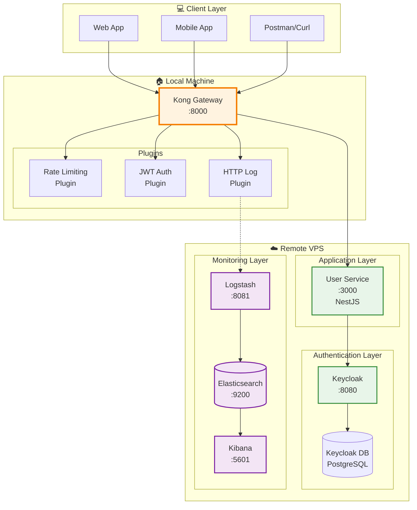

# Sơ Đồ Hệ Thống API Gateway Security Service

Tài liệu này chứa các sơ đồ chi tiết về luồng hoạt động và kiến trúc của hệ thống.

---

## 1. Sequence Diagram - Luồng Đăng Nhập (Login Flow)

Sơ đồ dưới đây mô tả chi tiết quá trình xác thực người dùng từ khi gửi thông tin đăng nhập cho đến khi nhận được JWT token.

### Giải Thích Chi Tiết

#### 🔹 Bước 1: Client Gửi Thông Tin Đăng Nhập
*   Client gửi `POST /auth/login` với body chứa `username` và `password`.
*   Request đầu tiên đến **Kong Gateway** (Port 8000).

#### 🔹 Bước 2: Kong Kiểm Tra Bảo Mật
*   **Rate Limiting:** Kiểm tra xem IP này đã vượt quá 5 request/giây chưa.
    *   Nếu vượt → Trả về `429 Too Many Requests`.
*   **Payload Validation:** Dùng Lua script kiểm tra cấu trúc JSON.
    *   Nếu thiếu `username` hoặc `password` → Trả về `400 Bad Request`.

#### 🔹 Bước 3: User Service Xác Thực Với Keycloak
*   Kong forward request đến **User Service** (Port 3000).
*   User Service **không tự tạo token**, thay vào đó:
    *   Gọi API của Keycloak: `POST /realms/myrealm/protocol/openid-connect/token`.
    *   Gửi `grant_type=password`, `username`, `password`.

#### 🔹 Bước 4: Keycloak Trả Về Token
*   Nếu thông tin đúng → Keycloak tạo và trả về `access_token` (JWT).
*   User Service nhận token và forward về cho Client qua Kong.

#### 🔹 Bước 5: Ghi Log (Async)
*   Kong đồng thời gửi log (status code, latency, IP) đến Logstash.
*   Log này sau đó được lưu vào Elasticsearch và hiển thị trên Kibana.

---

## 2. Sequence Diagram - Luồng Truy Cập API (Với JWT)

### Giải Thích

1.  **Client gửi token:** Trong header `Authorization: Bearer <token>`.
2.  **Kong xác thực JWT:**
    *   Dùng public key của Keycloak (đã được cấu hình trong `kong.yml`).
    *   Kiểm tra chữ ký (signature) và thời hạn (exp).
3.  **Nếu hợp lệ:** Forward request đến User Service.
4.  **User Service:** Decode JWT để lấy thông tin user và trả về.

---

## 3. Flowchart - Xử Lý Request Tổng Quát

---

## 4. Component Diagram - Kiến Trúc Chi Tiết

---

## Tóm Tắt

Tài liệu này cung cấp 4 loại sơ đồ chính:

1.  **Sequence Diagram (Login):** Luồng đăng nhập chi tiết với xác thực qua Keycloak.
2.  **Sequence Diagram (API Access):** Luồng truy cập API với JWT token.
3.  **Flowchart:** Quy trình xử lý request tổng quát tại Kong Gateway.
4.  **Component Diagram:** Kiến trúc tổng thể với các thành phần và kết nối.
